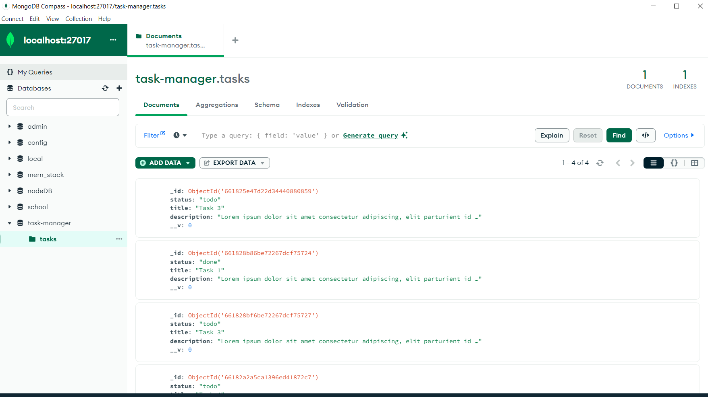
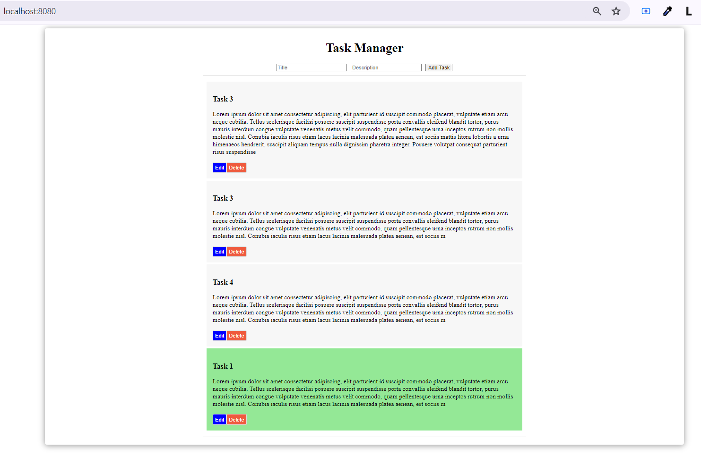
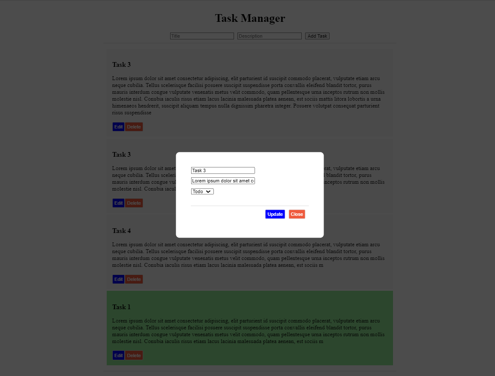

# Changes - MERN Task Manager Codebase Assessment

* Created server & client folder structure

## Server 

* Seperated router and model
* Made required changes in mongoose.connect
* npm install --save cors 

## Client
npm i dotenv

## Page

## Edit

## TS config
* `npm install --save typescript @types/node @types/react @types/react-dom @types/jest`
* Added custom.d.ts as a fix for import svg error
* npm install --save-dev @babel/preset-typescript
* npm install --save-dev @types/react @types/react-dom

## Tests
`npm install --save-dev jest`
`npm install --save-dev react-test-renderer`
`npm i -D @testing-library/react @testing-library/jest-dom`

`npm install --save-dev @babel/preset-react`